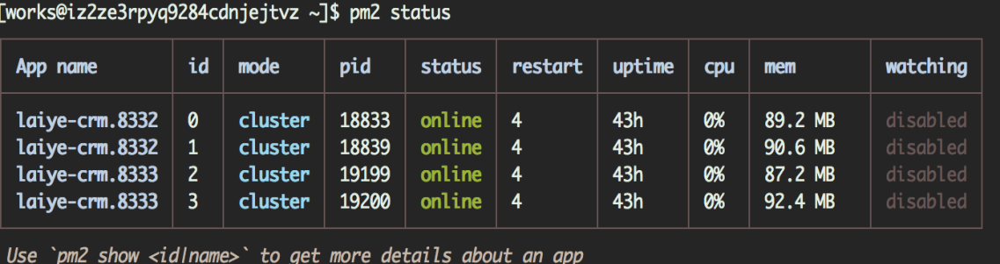

CRM目录在`/home/works/apps/crm-jingli/online`

# 安装依赖

``` bash
cd /home/works/apps/crm-jingli/online
cnpm install && yarn install
npm install -g pm2
```

# 配置

``` js
# config/private/mysql.config.js   配置mysql
...
production: {
    host: 'rm-uf62bx6y83t6yws19mo.mysql.rds.aliyuncs.com',
    port: 3306,
    user: 'gemii_root',
    password: 'gemii!@123',
    supportBigNumbers: true
}
...

# config/private/redis.config.js     配置redis
...
production: {
    retry_strategy: retryStrategy,
    db: '3',
    host: '127.0.0.1',
    port: 6379
}
...

# config/public/htmlPage href
...
links: [
    // { rel: 'dns-prefetch', href: 'https://at.alicdn.com' },
    // { rel: 'dns-prefetch', href: '//jingli.laiye.com' },
    // { rel: 'dns-prefetch', href: '//s1.laiye.com' },
    // { rel: 'dns-prefetch', href: '//s3.laiye.com' }
    // 将href替换成可访问的ip或域名
    { rel: 'dns-prefetch', href: '//pubcontent.gemii.cc/'},
    { rel: 'dns-prefetch', href: '//pubcontent.gemii.cc/'},
    { rel: 'dns-prefetch', href: '//pubcontent.gemii.cc/'},
    { rel: 'dns-prefetch', href: '//pubcontent.gemii.cc/'}
],
...

# .env.production          配置web服务域名
...
SERVER_API=http://pubcontent.gemii.cc/
...

# src/server/utils/aliyun.opensearch.utl.js     配置opensearch
...
const host = `opensearch-cn-shanghai.aliyuncs.com`
const accessSecret = 'x1VjJtlEJRNTkz1QbA7Z8ieDWJkUOX&' // 这里要注意'&'
const AccessKeyId = 'LTAIZ0kZiSmtZRA3'
...
```

> 注意 opensearch accessSecret 最后需要加个'&'字符

# 重新构建

修改配置文件

``` js
# package.json
  ...
  "lint-staged": {
    "src/**/*.js": [
      "prettier-eslint --write",
      // "eslint --max-warnings 10",    // 删除此行
      "git add"
    ]
  }
  ...
    "build:prod": {
        // "command": "npm run lint && npm run clean && babel-node tools/scripts/build",   // 修改成
        "command": "npm run clean && babel-node tools/scripts/build",
        "env": {
            "NODE_ENV": "production",
            "MODE": "prod"
        }
    }
  ...
```

备份之前的编译生成的文件

``` bash
mv build build.bak
mv static/jingli-crm/assets static/jingli-crm/assets.bak
```

重编

``` bash
npm run build:prod
```

# CRM前端配置

sed 替换生成前端文件的静态文件引用地址:

``` bash
cd static/crm-jingli/assets/
sed -i.bak 's/s[0,1].laiye.com/pubcontent.gemii.cc/g' ./*
```

若修改有误可以将所有bak文件批量还原

``` bash
find static/crm-jingli/assets/ -name '*.bak' -print0 | xargs -0 -I {} echo mv -f '{}' '{}' | sed 's/\.bak$//' | bash
```

# 启动CRM后端服务

``` bash
# 之前有进程注册 先清除
pm2 stop all
pm2 delete all

# 使用pm2启动4个服务
pm2 start pord.json
pm2 status
```



服务端口分别为
8332 8333

# nginx代理配置 CRM

`/etc/nginx/nginx.conf`

``` conf
http {
    ...
    upstream jingli_online {
        server 127.0.0.1:8332;
        server 127.0.0.1:8333;
    }
    ...
    server {
        ...
        # node.js crm
        location / {
                proxy_pass http://jingli_online;
        }
        # static
        location ~ \/static\/.*\.(js|css|ico|jpg|png|gif|eot|svg|ttf|woff|woff2|map|html) {
                root /home/works/apps/crm-jingli/online/;
                expires 7d;
                access_log off;
        }
        ...
    }
    ...
}
```

# 将works目录赋予nginx用户访问权限

``` bash
sudo usermod nginx -aG works      # nginx用户加入works group
sudo chmod 750 /home/works        # 赋予works目录works group的rx权限
```

systemctl start nginx
systemctl enable nginx

```
crm地址:
http://pubcontent.gemii.cc

登录账号:
jingli_laiye
jingli@demo
```