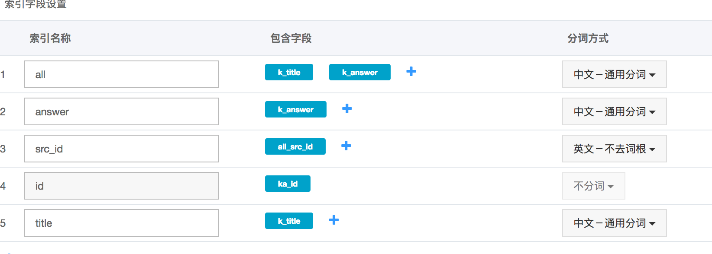
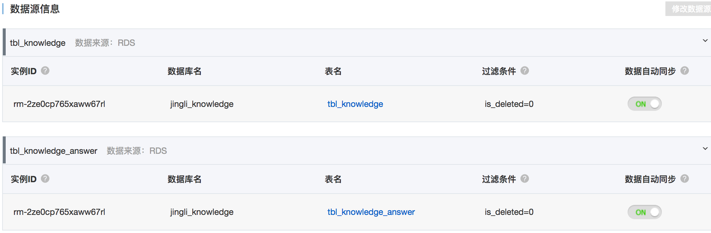
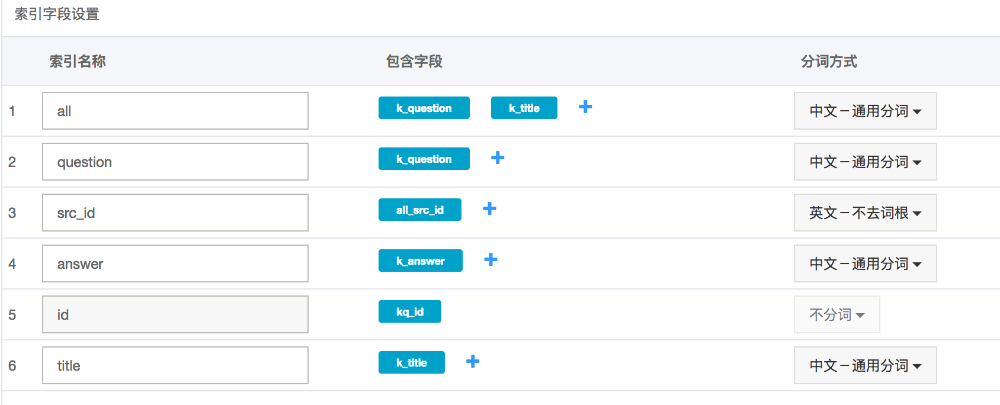
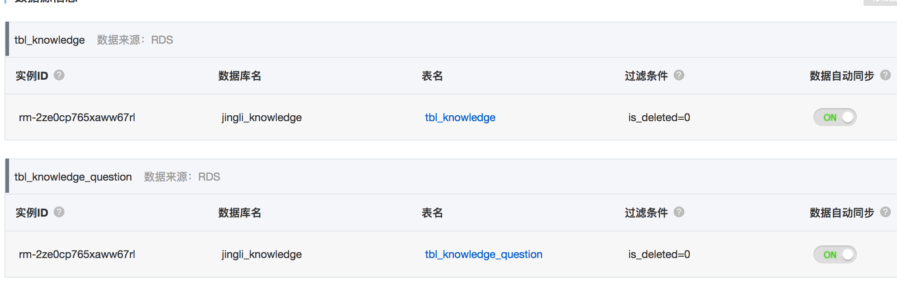
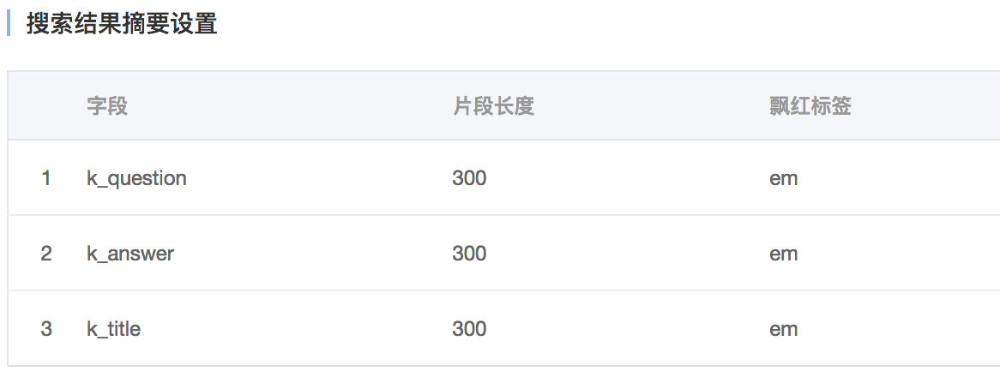

# 母婴智能问答系统线上部署 说明文档

## 知识库和管理平台 CRM

### 运行环境

- 云资源

知识库管理平台运行于aws ecs服务器,同时使用了阿里云的云数据库和开放搜索 (OPENSEARCH)

服务器
所在云服务器公网地址为52.80.194.120,操作系统为CentOS7。

云数据库
数据库软件为云数据库mysql v5.6
appid:    rm-uf62bx6y83t6yws19
内网地址:  rm-uf62bx6y83t6yws19.mysql.rds.aliyuncs.com
外网地址:  rm-uf62bx6y83t6yws19mo.mysql.rds.aliyuncs.com
用户:     gemii_root
密码:     gemii!@123

<!-- 地址:    lizcloud4c.chnh6yhldzwc.rds.cn-north-1.amazonaws.com.cn:3306
登陆账号: root / Rg3UrelC -->

知识库web访问地址为 http://pubcontent.gemii.cc/，web服务使用node js v6.9.5搭建，运行于端口8332、8333，使用nginx做80端口反代，使用pm2 v2.5.0控制和监控web服务，使用服务器本地redis v3.2.3作为临时key-value存储工具，使用端口6379、db3作为使用实例。

### 准备和基础服务

以root账号登陆 安装基础服务

``` bash
yum install -y epel-release
yum install –y wget lrzsz nginx redis
yum install –y mysql/mariadb          # 安装数据库客户端
(yum –y install mysql-server)         # 使用本地数据库另外安装mysql服务端
```

关闭防火墙

``` bash
setenforce 0
sed -i 's/^SELINUX=enforcing$/SELINUX=disabled/' /etc/selinux/config
systemctl stop firewalld
```

- redis配置

``` conf
# /etc/redis.conf
daemonize yes
save ""
bind 127.0.0.1
```

开启自启动

``` bash
systemctl start redis
systemctl enable redis
```

- nginx等后续各服务配置好再配置

- 创建works用户

``` bash
useradd -m works
cd /home/works && su works
```

之后的应用服务必须放在/home/works下 否则需要从代码中修改路径

- nvm

``` bash
wget -qO- https://raw.githubusercontent.com/creationix/nvm/v0.33.4/install.sh | bash
```

### 拷贝线上服务的所有文件(/home/works目录)到当前部署的主机

清除旧的log

``` bash
find . -regex ".*\.log\.[0-9]*" -print0 | xargs -0 -I {} rm '{}'
```

- nodejs & yarn

``` bash
nvm install v6.9.5
node -v
```

多个node环境 需要手动切换v6.9.5

``` bash
nvm alias default v6.9.5
nvm use v6.9.5
npm install -g cnpm yarn
```

### 数据库迁移

``` bash
# 拷贝原始数据到当前部署的RDS
mysqldump ... > jingli_knowledge_20190213.sql
mysql -h lizcloud4c.chnh6yhldzwc.rds.cn-north-1.amazonaws.com.cn -u root -p
create database jingli_knowledge;
mysql -h lizcloud4c.chnh6yhldzwc.rds.cn-north-1.amazonaws.com.cn -u root jingli_knowledge -p < jingli_knowledge_20190213.sql
```

### opensearch

给CRM后台的查询功能提供接口

#### 配置RDS访问白名单

> lan:
> 192.168.0.0/24
> gemii:
> 116.236.177.182
> opensearch:
> 100.104.248.0/24	11.127.123.0/24	11.193.153.11	11.195.170.19
> 11.196.18.13	11.196.19.20
> 11.217.213.0/24	11.217.217.0/24	11.217.219.0/24	
> aws:
> 52.80.194.120

#### 创建opensearch应用

参考:
<https://help.aliyun.com/document_detail/29119.html?spm=5176.7946605.1326713.4.70628b6cydTDZx>
注意: 区域要和RDS相同 选择高级版 入门型每个区域只能申请两个

#### 添加RDS数据源配置

1.  jingli_knowledge_answer: 提供答案和标题的匹配搜索api
    主表
    
    
    
    辅表
    
    
    
    搜索字段映射
    
    
    
    属性字段设置和默认展示字段
    
    
    
    数据源信息
    
    

2.  jingli_question: 提供全部匹配搜索api和问题的匹配搜索api
    主表
    
    
    
    辅表
    
    
    
    搜索字段映射
    
    
    
    属性字段设置和默认展示字段
    
    
    
    数据源信息
    
    

3.  搜索结果飘红展示
    
    

> 注意: 配置时字段名必须和示例完全一致

#### 申请access key配置到服务中

-   shanghai (gemii账号)
    
    > host:
    > opensearch-cn-shanghai.aliyuncs.com
    > AccessKeyID：
    > LTAIZ0kZiSmtZRA3
    > AccessKeySecret：
    > x1VjJtlEJRNTkz1QbA7Z8ieDWJkUOX

-   beijing (laiye账号)
    
    > host:
    > opensearch-cn-beijing.aliyuncs.com
    > AccessKeyID：
    > LTAI9vymbGg5dWSw
    > AccessKeySecret:
    > JN5IDWdAdCFCHfQSpkZJNQ0bK2DSzA

### 部署CRM

CRM目录在`/home/works/apps/crm-jingli/online`

- 安装依赖

``` bash
cd /home/works/apps/crm-jingli/online
cnpm install && yarn install
npm install -g pm2
```

- 配置

``` js
# config/private/mysql.config.js   配置mysql
...
production: {
    host: 'lizcloud4c.chnh6yhldzwc.rds.cn-north-1.amazonaws.com.cn',
    port: 3306,
    user: 'root',
    password: 'Rg3UrelC',
    supportBigNumbers: true
}

production: {
    host: 'rm-uf62bx6y83t6yws19mo.mysql.rds.aliyuncs.com',
    port: 3306,
    user: 'gemii_root',
    password: 'gemii!@123',
    supportBigNumbers: true
}
...

rm-uf62bx6y83t6yws19mo.mysql.rds.aliyuncs.com
# config/private/redis.config.js     配置redis
...
production: {
    retry_strategy: retryStrategy,
    db: '3',
    host: '127.0.0.1',
    port: 6379
}
...

# config/public/htmlPage href
...
links: [
    // { rel: 'dns-prefetch', href: 'https://at.alicdn.com' },
    // { rel: 'dns-prefetch', href: '//jingli.laiye.com' },
    // { rel: 'dns-prefetch', href: '//s1.laiye.com' },
    // { rel: 'dns-prefetch', href: '//s3.laiye.com' }
    // 将href替换成可访问的ip或域名
    { rel: 'dns-prefetch', href: '//pubcontent.gemii.cc/'},
    { rel: 'dns-prefetch', href: '//pubcontent.gemii.cc/'},
    { rel: 'dns-prefetch', href: '//pubcontent.gemii.cc/'},
    { rel: 'dns-prefetch', href: '//pubcontent.gemii.cc/'}
],
...

# .env.production          配置web服务域名
...
SERVER_API=http://pubcontent.gemii.cc/
...

# src/server/utils/aliyun.opensearch.utl.js     配置opensearch
...
const host = `opensearch-cn-shanghai.aliyuncs.com`
const accessSecret = 'x1VjJtlEJRNTkz1QbA7Z8ieDWJkUOX&' // 这里要注意'&'
const AccessKeyId = 'LTAIZ0kZiSmtZRA3'
...
```

> 注意 opensearch accessSecret 最后需要加个'&'字符

- 重新构建

修改配置文件

``` js
# package.json
  ...
  "lint-staged": {
    "src/**/*.js": [
      "prettier-eslint --write",
      // "eslint --max-warnings 10",    // 删除此行
      "git add"
    ]
  }
  ...
    "build:prod": {
        // "command": "npm run lint && npm run clean && babel-node tools/scripts/build",   // 修改成
        "command": "npm run clean && babel-node tools/scripts/build",
        "env": {
            "NODE_ENV": "production",
            "MODE": "prod"
        }
    }
  ...
```

备份之前的编译生成的文件

``` bash
mv build build.bak
mv static/jingli-crm/assets static/jingli-crm/assets.bak
```

重编

``` bash
npm run build:prod
```

- CRM前端配置

sed 替换生成前端文件的静态文件引用地址:

``` bash
cd static/crm-jingli/assets/
sed -i.bak 's/s[0,1].laiye.com/pubcontent.gemii.cc/g' ./*
```

若修改有误可以将所有bak文件批量还原

``` bash
find static/crm-jingli/assets/ -name '*.bak' -print0 | xargs -0 -I {} echo mv -f '{}' '{}' | sed 's/\.bak$//' | bash
```

- 启动CRM后端服务

``` bash
# 之前有进程注册 先清除
pm2 stop all
pm2 delete all

# 使用pm2启动4个服务
pm2 start pord.json
pm2 status
```

<图>

服务端口分别为
8332 8333

- nginx代理配置 CRM

`/etc/nginx/nginx.conf`

``` conf
http {
    ...
    upstream jingli_online {
        server 127.0.0.1:8332;
        server 127.0.0.1:8333;
    }
    ...
    server {
        ...
        # node.js crm
        location / {
                proxy_pass http://jingli_online;
        }
        # static
        location ~ \/static\/.*\.(js|css|ico|jpg|png|gif|eot|svg|ttf|woff|woff2|map|html) {
                root /home/works/apps/crm-jingli/online/;
                expires 7d;
                access_log off;
        }
        ...
    }
    ...
}
```

- 将works目录赋予nginx用户访问权限

``` bash
sudo usermod nginx -aG works      # nginx用户加入works group
sudo chmod 750 /home/works        # 赋予works目录works group的rx权限
```

systemctl start nginx
systemctl enable nginx

登录地址:
http://pubcontent.gemii.cc

登录账号:
jingli_laiye
jingli@demo

## 问答服务

智能问答系统采用检索+排序架构实现问题和候选知识点的语义匹配，其架构示意图及各个模块功能描述如下。
<图>

各服务必须使用名为works的用户

### 索引服务

`/home/works/tools/elasticsearch-5.4.0`

该模块利用经审核的知识库数据建立倒排索引，用于召回问题的候选回复集合。
该模块只负责检索召回，不涉及业务逻辑，选用开源搜索引擎ElasticSearch搭建，安装jieba插件作为项目使用的中文分词器。通过supervisor进行管理。

- JDK & supervisor

``` bash
sudo yum install java-1.8.0-openjdk-devel
java -version
sudo pip install supervisor
```

- 启动es

``` bash
cd ~/tools/elasticsearch-5.4.0
supervisord -c config/sup.kb_es_node.conf
supervisorctl -c config/sup.kb_es_node.conf        # 查看状态
```

### 检索/排序模块

`/home/works/online-services/qa-search`

项目的检索+排序过程都封装在这个模块中。
检索:该模块的输入是问题文本，它调用检索服务后，根据业务需求做必要的处理，返回候选回复集合。
具体功能包括：对输入的问题做分词、词性过滤、同义词变换并构造ES检索表达式调用ES检索，同时对召回结果进行去重等操作。
该模块为问答系统内部服务，是Python开发的web service，供内部访问,不对外提供服务接口。
排序:该模块负责对由检索模块初步召回的候选回复集合做重排序，排序的主要依据是问题与候选知识点的语义相关性。

该模块由virtualenv提供隔离运行环境，且通过supervisor进行守护。所以，需要先激活virtualenv环境并安装好该模块依赖的第三方packages才能正常启动。

- 配置

``` python
# bin/conf.py
g_gemii_db_cfg = {
    'dbtype': 'mysql',
    'host': 'lizcloud4c.chnh6yhldzwc.rds.cn-north-1.amazonaws.com.cn',
    'port': 3306,
    'user': 'root',
    'password': 'Rg3UrelC',
    'dbname': 'jingli_knowledge',
}

g_qa_search_api_cfg = {
    'host': '127.0.0.1',    # 配置成qa-search前端的nginx服务地址
}
```

- 启动

``` bash
cd ~/online-services/qa-search
source venv/bin/activate
supervisord -c conf/sup.qsearch.conf
supervisorctl -c conf/sup.qsearch.conf        # 查看状态
```

端口占用 8131 - 8136

- nginx

``` bash
    ...
    upstream py_in_qasearch_jingli {
        server 127.0.0.1:8131;
        server 127.0.0.1:8132;
        server 127.0.0.1:8133;
        server 127.0.0.1:8134;
        server 127.0.0.1:8135;
        server 127.0.0.1:8136;
    }
    ...
    # @hailong: jingli qasearch api (internal api)
    location /in/nlp/tob/ {
        proxy_pass http://py_in_qasearch_jingli;
    }
    ...
```

### 问答接口模块

`/home/works/online-services/qa-coapi-jingli`
该模块提供对外接口服务，具体功能包括：用户鉴权，输入校验，调用检索/排序模块，生成topN条候选回复，按接口文档格式打包返回给调用方。该模块是Python开发的web service，调用内部服务，对外提供HTTP方式的访问接口。
该模块由virtualenv提供隔离运行环境，且通过supervisor进行守护。所以，需要先激活virtualenv环境并安装好该模块依赖的第三方packages才能正常启动。

- 配置

``` python
# bin/conf.py
g_gemii_db_cfg = {
    'dbtype': 'mysql',
    'host': 'lizcloud4c.chnh6yhldzwc.rds.cn-north-1.amazonaws.com.cn',
    'port': 3306,
    'user': 'root',
    'password': 'Rg3UrelC',
    'dbname': 'jingli_knowledge',
}
```

- 启动

``` bash
cd ~/online-services/qa-search
source venv/bin/activate
supervisord -c conf/sup.qa_coapi.conf
supervisorctl -c conf/sup.qa_coapi.conf        # 查看状态
```

端口占用 8250 - 8255

- nginx

``` conf
    ...
    upstream py_coapi_jingli {
        server 127.0.0.1:8250;
        server 127.0.0.1:8251;
        server 127.0.0.1:8252;
        server 127.0.0.1:8253;
        server 127.0.0.1:8254;
        server 127.0.0.1:8255;
    }
    ...
    # @zhenguo: jingli ai service
    location /v1/dialog/ {
        proxy_pass http://py_coapi_jingli;
    }
    location /v1/knowledge/ {
        proxy_pass http://py_coapi_jingli;
    }
    location /v1/analytics/ {
        proxy_pass http://py_coapi_jingli;
    }
    location /v1/issue/ {
        proxy_pass http://py_coapi_jingli;
    }
    ...
```

### 知识点推荐及接口统计模块

`/home/works/online-services/qa-gemmi-stats`

该模块负责统计挖掘高频但未成功召回的知识点，并为其推荐相关的知识点，推荐结果供管理人员审核。此外，问答系统接口相关的统计脚本（如接口调用次数、召回率）也由该模块实现。

该模块是Python开发的脚本，完成知识点推荐、接口数据统计等离线需求,模块由virtualenv提供隔离运行环境,通过crontab定时运行(运行频率：1次/天).在works帐号的crontab任务列表里添加如下配置(每天早上05:01执行1次):

- 配置

``` python
# bin/config.py
DB_HOST = 'lizcloud4c.chnh6yhldzwc.rds.cn-north-1.amazonaws.com.cn'
DB_PORT = '3306'
DB_USER = 'root'
DB_PASSWORD = 'Rg3UrelC'
DB_NAME = 'jingli_knowledge'
```

``` bash
# bin/configure.sh
host="lizcloud4c.chnh6yhldzwc.rds.cn-north-1.amazonaws.com.cn"
port=3306
user="root"
password="Rg3UrelC"
database="jingli_knowledge"
```

- 自启动

``` bash
crontab -e

01 05 * * * cd /home/works/online-services/qa-gemii-stats && (source venv/bin/activate && sh ./bin/run.sh 2>&1 1>cron.log)
```
