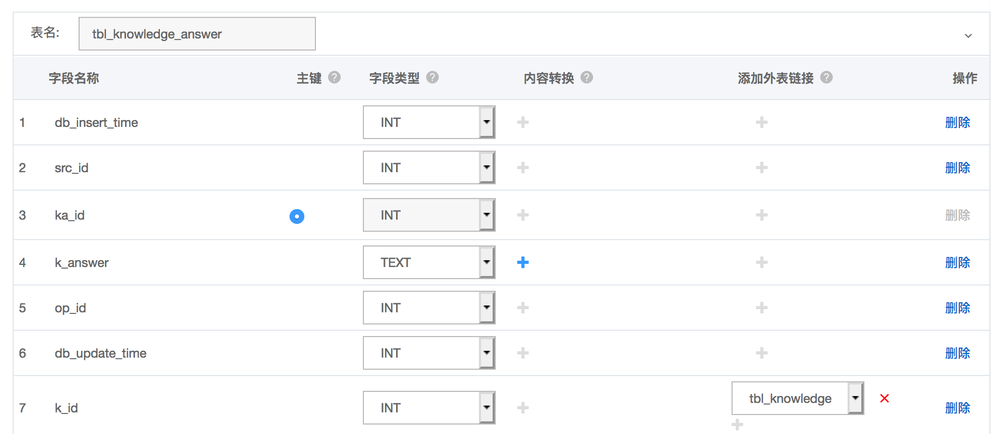
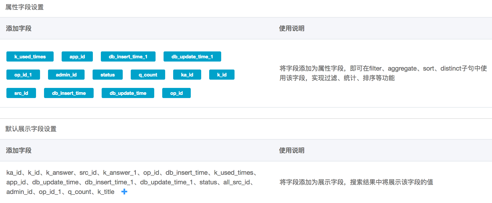
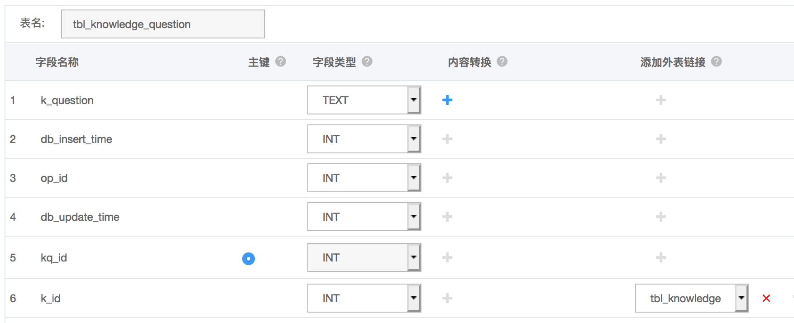
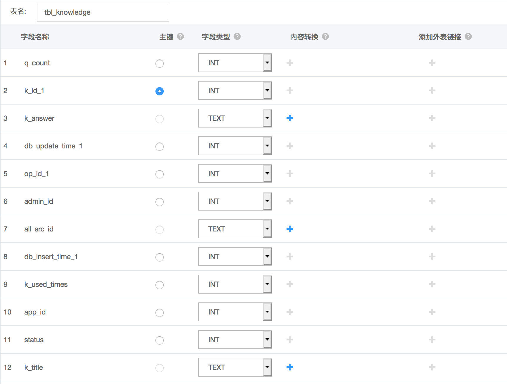
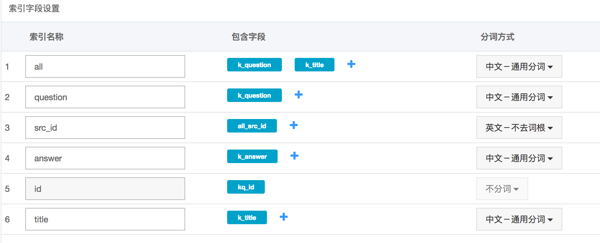
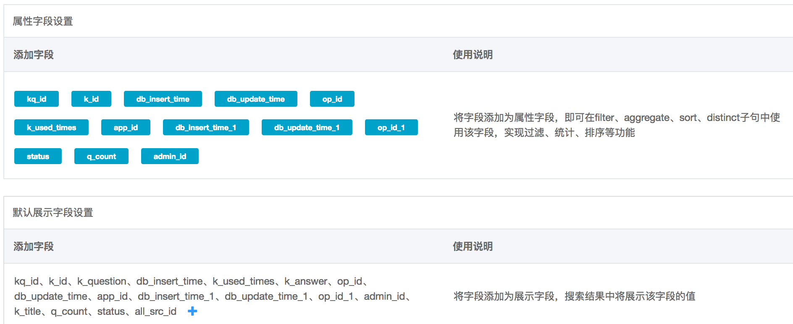
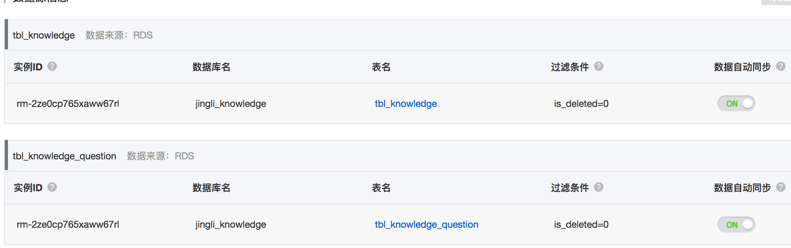
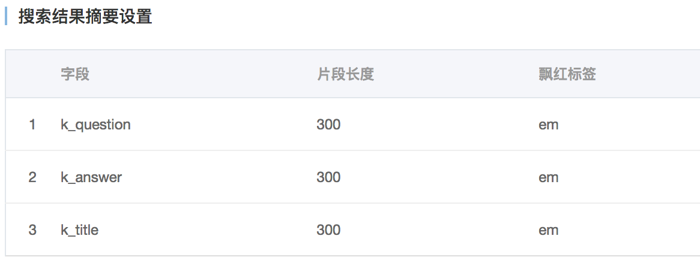

opensearch上的应用给CRM后台的查询功能提供接口

# 配置RDS访问白名单

```
lan:
192.168.0.0/24
gemii:
116.236.177.182
opensearch:
100.104.248.0/24	11.127.123.0/24	11.193.153.11	11.195.170.19
11.196.18.13	11.196.19.20
11.217.213.0/24	11.217.217.0/24	11.217.219.0/24	
aws:
52.80.194.120
```

# 创建opensearch应用

参考:

<https://help.aliyun.com/document_detail/29119.html?spm=5176.7946605.1326713.4.70628b6cydTDZx>

> 注意: 区域要和RDS相同 选择高级版 入门型每个区域只能申请两个

# 添加RDS数据源配置

## jingli_knowledge_answer

提供答案和标题的匹配搜索api

主表



辅表


搜索字段映射


属性字段设置和默认展示字段



数据源信息


## jingli_question

提供全部匹配搜索api和问题的匹配搜索api

主表



辅表



搜索字段映射



属性字段设置和默认展示字段



数据源信息



## 搜索结果飘红展示



> 注意: 配置时字段名必须和示例完全一致

# 申请access key配置到服务中

-   opensearch-shanghai (gemii账号)

```
> host:
> opensearch-cn-shanghai.aliyuncs.com
> AccessKeyID：
> LTAIZ0kZiSmtZRA3
> AccessKeySecret：
> x1VjJtlEJRNTkz1QbA7Z8ieDWJkUOX
```

-   opensearch-beijing (laiye账号)

```
> host:
> opensearch-cn-beijing.aliyuncs.com
> AccessKeyID：
> LTAI9vymbGg5dWSw
> AccessKeySecret:
> JN5IDWdAdCFCHfQSpkZJNQ0bK2DSzA
```